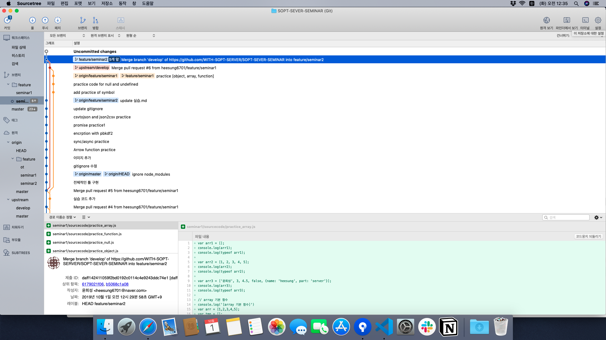
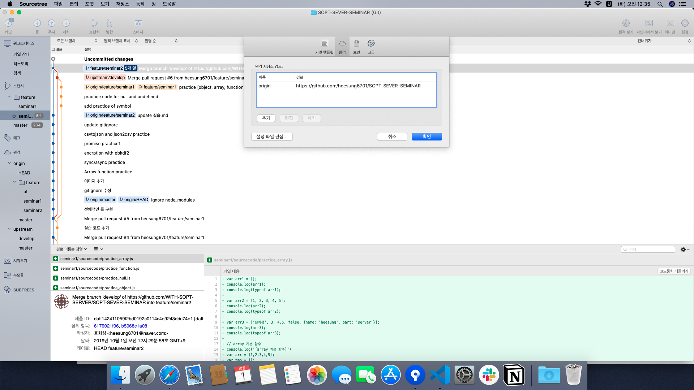
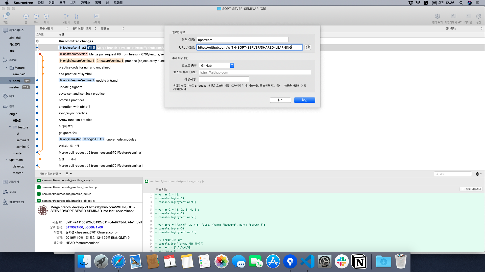
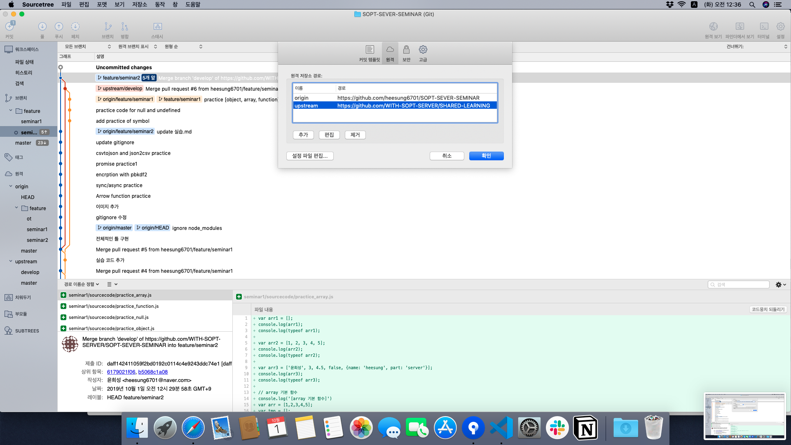
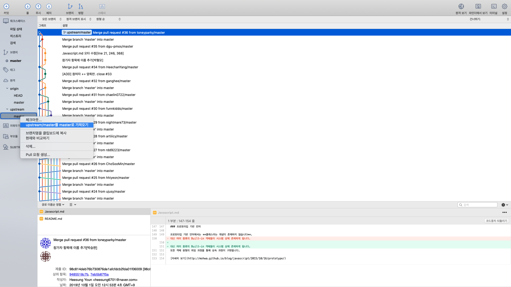

# GitHub 실습 (for 공유 문서 프로젝트)

지난 1차 세미나에서는 문서를 수정해서 Pull Request를 하는 실습을 진행했습니다.

[SHARED-LEARNING](https://github.com/WITH-SOPT-SERVER/SHARED-LEARNING) 페이지에 가보면
참가자 목록의 이름이 추가된 것을 확인 할 수 있습니다.

하지만 개인 Repository에 들어가보면 위 링크가 아닌 이전 버전인 것을 확인할 수 있습니다.
이러한 이유는 개개인의 작업(Pull Request)를 통해서 합쳐진 공간은 WITH-SOPT-SERVER/SHARED-LEARNING 페이지이기 때문에
개인 Repository(개인git아이디/SHARED-LEARNING)에서는 적용이 안되었습니다.

Local(컴퓨터)에서 개인 Repository에서만 pull을 받았다면 이제는 공동 작업 Repository에 적용된 내용을 가져오는 실습을 진행하겠습니다.

1. 먼저 sourcetree를 켜줍니다.

2. 우측 상단에 설정을 클릭하고 원격(또는 Remote) 탭을 클릭합니다.

3. 추가버튼을 눌러줍니다.

> 이때 기존에 있던 원격저장소의 이름을 origin으로 바꿔주면 이후에 편리합니다. 개인 저장소는 origin, 공용 저장소는 upstream으로 구분하면 편리합니다.

4. 원격 저장소의이름은 `upstream`, URL 주소는 공용 저장소의 주소(https://github.com/WITH-SOPT-SERVER/SHARED-LEARNING)으로 지정합니다.

5. 확인을 눌러주면 왼쪽 아래에 원격 아래의 upstream이 생긴것을 확인할 수 있습니다. 그리고 우 클릭을 하면 upstream에서 가져오기 버튼이 있습니다.

6. upstream에서 가져오기를 한다면 서버에서 작업한 내용이 local 공간에 적용되는 것을 확인 할 수 있습니다.

